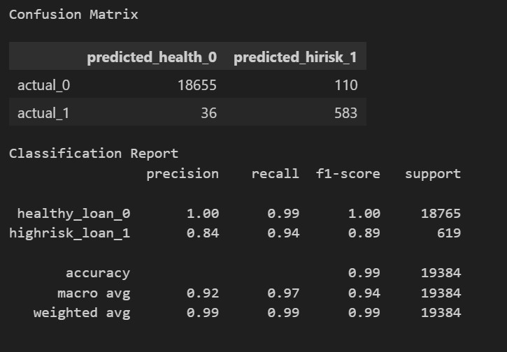

# Module 20 Challenge Credit Risk Analysis Report

## Overview of the Analysis

* The purpose of this analysis, is to train and evaluate a machine learning model based on loan risk. 

* A historical lending activity from a peer-to-peer lending services company was used as the dataset to build a model that can identify the creditworthiness of borrowers.

* The target values the training model used was loan_status in the dataset. The features the model used to evaluate the loan status were loan size, intrest rate, borrrower income, debt-to-income, number of accounts, derogatory marks, and total debt.

* The loan_status values contained values of zero and one. A value of zero indicates a healthy loan and one indicates that there is high risk of the loan of defaulting. The breakdown of the dataset contained 75,036 healthy loans (value 0) and 2,500 high risk loans (value 1).

* Describe the stages of the machine learning process you went through as part of this analysis.

* The `Logistic Regression Model` was used to create and train the machine learning model. The following stages were performed:

- Imorted dataset into Panda DataFrames
- Create label set (y) from 'loan_status' and features (X) from the remaining columns.
- Split the data into training and testing datasets using train_test_split()
- Create logistic regression model and fit the original data
- Create predictions using the model predict method
- Evaluate the model's performance by creating a confusion matrix and classification report

## Results

Using bulleted lists, describe the accuracy scores and the precision and recall scores of all machine learning models.

* Machine Learning Model - Logistic Regression:

The following are the results of the training model that was performed on the original data:

* The model returned an accuracy score of 99.0% which indicates that it did a very good job in predicting healthy and high-risk loans. However, high-risk loans were only predicted 84.0% of the time. The high-risk loans were not predicted accurately because the dataset is imbalanced, since 96.77% (75,036 of 77,536) of the records in the dataset are healthy loans.

* The model had 100% precision for healthy loans and 85% for high-risk loans. This disparity in precision scores is due to the imbalance of healthy loans to high-risk loans in the dataset.

* The recall score for healthy loans was 99.0% and 94.0% for high-risk loans. These scores indicate that the model could only predict high-risk loans 94.0% of the time and healthy loans 99.0% of the time.

## Summary

Based on the results of Logistic Regression model, this was not sufficient enough to accurately predict high-risk loans. This is due to the imbalance of healthy to high-risk loans in the dataset. Determining high-risk loans is a priority for the loan service provider since an error could result in higher rate of loans defaults.
